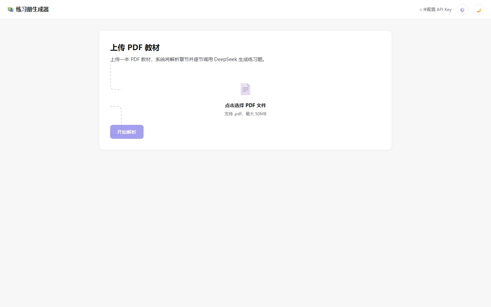
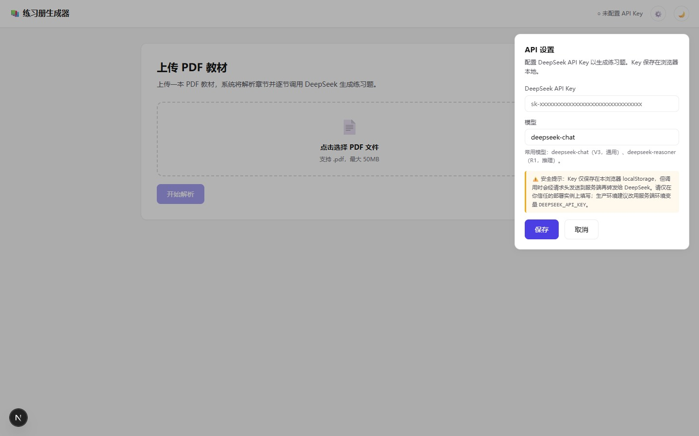
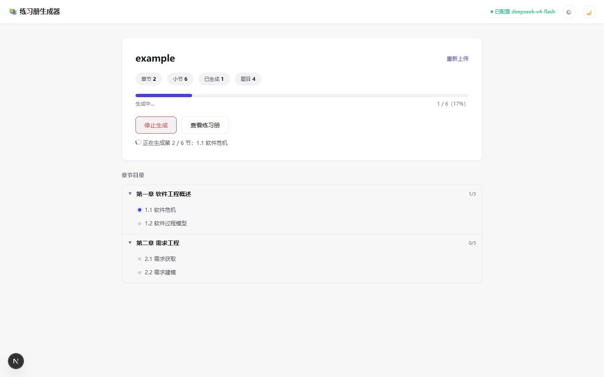
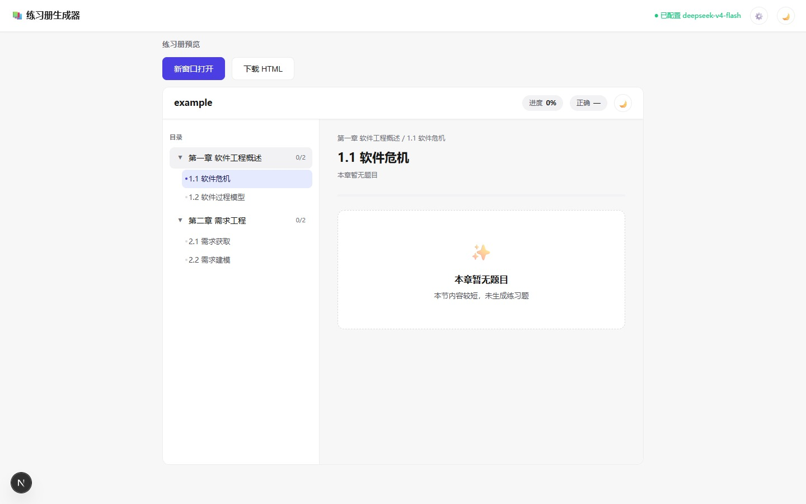

<div align="center">

# 🔥 炼书 · BookForge

**把任何 PDF 教材，炼成一本可答题、可判分、带解析的交互式练习册。**

[](./LICENSE)
[](https://nextjs.org/)
[](https://platform.deepseek.com/)

</div>

<div align="center">
  
</div>

---

## 这是什么？

读一本厚厚的 PDF 教材，常常读完就忘。**炼书**帮你把教材「炼」成练习册——上传 PDF，AI 自动识别每个章节，逐节生成单选、多选、判断、填空四种题型的练习题，每题带难度等级和详细解析。生成的练习册是一个**精美单文件 HTML**，支持即时判题、进度追踪、暗色模式、移动端适配，可离线使用。

> 一边读，一边练。把书本炼成能力。

## ✨ 特性

- 📄 **纯前端 PDF 解析** —— 基于 [pdfjs-dist](https://github.com/mozilla/pdf.js)，PDF 不上传服务器，无大小限制，无隐私泄露
- 🧠 **智能章节识别** —— 优先读 PDF 内置目录，无目录时按正则识别「第X章」「X.Y」等标题
- 🎯 **四种题型** —— 单选 / 多选 / 判断 / 填空，每题含难度和解析，难度分布合理
- ⚡ **即时判题 + 进度追踪** —— 答题即判分，章节侧边栏显示完成度，localStorage 持久化
- 🎨 **精美单文件 HTML 导出** —— 暗色模式、移动端适配、章节树侧边栏，一个文件搞定一切
- 🔑 **双 Key 配置** —— 服务端环境变量（生产推荐）或浏览器端临时填写（演示方便）
- ⏸️ **可中断生成** —— 一键停止，已生成题目保留，AbortController 即时中断

## 📸 演示

<div align="center">

**上传界面** —— 纯前端解析，Key 状态一目了然



**API 设置面板** —— 浮层式，浏览器端临时填写，含安全提醒



**生成中** —— 章节树 + 进度统计 + 逐节生成



**练习册预览** —— 即时判题、解析、进度追踪



</div>

## 🎯 在线 Demo

> ⚠️ Demo 实例未配置服务端 API Key，请在页面右上角「设置」中填入你自己的 API Key 后使用（支持 DeepSeek / OpenAI / OpenRouter 等厂商）。Key 仅保存在你的浏览器本地。

**Demo 地址**：[https://exercise-agent-6lxusneq8w-zv3u9l4nvx.preview.iga-pages.com?iga_token=0db74cab7483001f8bf3127f01c433bd&iga_time=1786361574](https://exercise-agent-6lxusneq8w-zv3u9l4nvx.preview.iga-pages.com?iga_token=0db74cab7483001f8bf3127f01c433bd&iga_time=1786361574)

（Demo 部署于火山引擎 IGA Pages 的预览环境。预览链接含访问 token，每次重新部署会更新且可能过期；如链接失效，建议自行部署。）

## 🛠 技术栈

| 层 | 选型 | 说明 |
|---|---|---|
| 框架 | [Next.js](https://nextjs.org/) 16 (App Router) | 全栈，API Route 调 LLM |
| PDF 解析 | [pdfjs-dist](https://github.com/mozilla/pdf.js) | 浏览器端，无上传 |
| LLM | [DeepSeek API](https://platform.deepseek.com/) | OpenAI 兼容协议，via `openai` SDK |
| 前端 | React 19 + 纯 CSS | 无 UI 框架，零额外依赖 |
| 语言 | JavaScript | 无 TypeScript |

## 📦 本地运行

### 1. 克隆并安装依赖

```bash
git clone <your-repo-url>
cd 练习册/web
npm install
```

### 2. 配置 DeepSeek API Key（二选一）

**方式 A：服务端环境变量（推荐，安全）**

```bash
cp .env.example .env.local
# 编辑 .env.local，填入你的 API Key
# DEEPSEEK_API_KEY=sk-xxxxxxxxxxxxxxxxxxxxxxxxxxxxxxxx
```

申请地址：https://platform.deepseek.com/api_keys

**方式 B：浏览器端临时填写（方便体验）**

跳过环境变量配置，启动后在页面右上角点击 ⚙️「设置」填入 Key。Key 仅保存在当前浏览器 localStorage，调用时经请求头透传到服务端再转发给 DeepSeek。

> ⚠️ **安全提示**：方式 B 中你的 Key 会经过部署的服务端。请仅在你信任的部署实例上使用此方式；公开 Demo 上请勿填写真实 Key。

### 3. 启动开发服务器

```bash
npm run dev
```

打开 [http://localhost:3000](http://localhost:3000)。

### 4. 生产构建

```bash
npm run build
npm run start
```

## 🚀 部署

本项目是标准 Next.js 应用，可部署到任何支持 Node.js 的平台：

- **Vercel**：导入 GitHub 仓库，在项目设置中添加环境变量 `DEEPSEEK_API_KEY` 即可。
- **火山引擎 IGA Pages**：参考[官方文档](https://www.volcengine.com/product/iga-pages)，部署后配置环境变量。
- **自托管**：`npm run build && npm run start`，用 nginx 反代 3000 端口。

> 不论部署到哪里，**务必通过环境变量配置 `DEEPSEEK_API_KEY`**，不要把 Key 写进代码或提交到仓库。

## 📖 使用流程

1. 打开页面，点击「点击选择 PDF 文件」上传一本 PDF 教材。
2. 点击「开始解析」，浏览器本地解析章节结构（大文件可能需要几秒）。
3. 解析完成后，点击「开始生成」，逐节调用 DeepSeek 生成练习题。
4. 生成过程中可随时点击「停止生成」，已生成的题目会保留。
5. 全部生成后，点击「查看练习册」预览，可「下载 HTML」导出为单文件。

## 📂 项目结构

```
练习册/
├── docs/                            # README 配图
│   ├── banner.jpg
│   ├── screenshot-upload.jpg
│   ├── screenshot-settings.jpg
│   ├── screenshot-generate.jpg
│   └── screenshot-exercise.jpg
├── web/
│   ├── app/
│   │   ├── api/generate/route.js   # 生成练习题的 API 接口
│   │   ├── PdfParserClient.js       # 浏览器端 PDF 解析模块
│   │   ├── page.js                  # 主页面（上传、解析、生成、预览）
│   │   └── layout.js
│   ├── lib/
│   │   ├── deepseek.js              # DeepSeek API 调用 + Prompt
│   │   └── exercise-template.js     # 练习册 HTML 模板
│   ├── public/
│   ├── .env.example                 # 环境变量示例
│   ├── next.config.js
│   └── package.json
├── .gitignore
├── LICENSE
└── README.md
```

## 🔒 隐私说明

- **PDF 文件**：完全在你的浏览器本地解析，不会上传到任何服务器。
- **章节文本**：生成练习题时，章节文本会发送到你部署的服务端，再转发给 DeepSeek API。
- **API Key**：服务端环境变量方式下 Key 不离开服务端；浏览器端填写方式下 Key 会经请求头发送到服务端。
- **答题记录**：仅保存在你的浏览器 localStorage，不上传任何服务器。

## 🤝 适合谁用

- 📚 想把教材读厚再读薄的学生
- 👨‍🏫 需要快速出练习题的教师
- 🧑‍💻 喜欢边读边练的自学者
- 🔬 想体验「PDF + LLM 自动出题」的开发者

## 📄 License

[MIT](./LICENSE)

---

<div align="center">

**炼书 · BookForge** —— 把书本炼成能力 🔥

</div>
